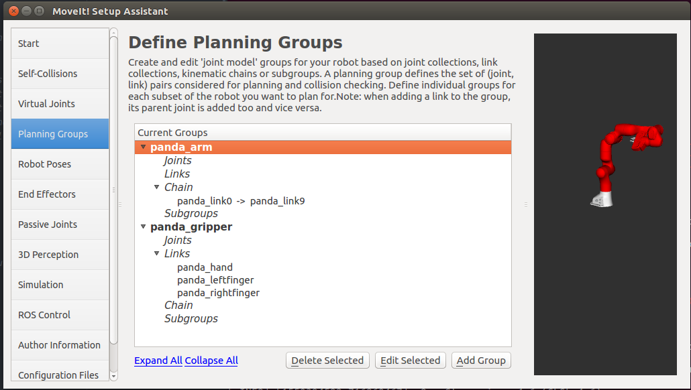
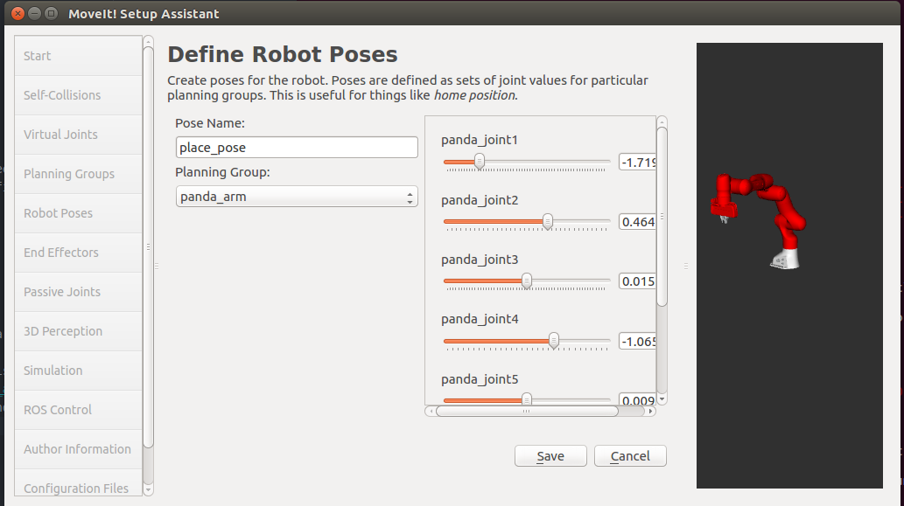

# BionicDL-CobotLearning-Project1
In this project, you must assimilate your work from previous exercises to successfully complete a tabletop pick and place operation using Franka in Gazebo.

The system is without perception and the pick list is given.

# Project Setup
Before running the project, make sure you've installed ROS kinetic (http://wiki.ros.org/kinetic/Installation/Ubuntu) and catkin_tools (https://catkin-tools.readthedocs.io/en/latest/installing.html).

For this setup, catkin_ws is the name of active ROS Workspace, if your workspace name is different, change the commands accordingly
If you do not have an active ROS workspace, you can create one by:
```sh
$ mkdir -p ~/catkin_ws/src
$ cd ~/catkin_ws/
$ catkin build
```

Now that you have a workspace, clone or download this repo into the src directory of your workspace:
```sh
$ cd ~/catkin_ws/src
$ git clone https://github.com/ancorasir/BionicDL-CobotLearning-Project1.git
```

Now install missing dependencies (ros-kinetic-libfranka) using rosdep install:
```sh
$ cd ~/catkin_ws
$ rosdep install --from-paths src --ignore-src --rosdistro=kinetic -y
$ sudo apt-get install ros-kinetic-moveit-visual-tools
$ sudo apt-get install ros-kinetic-trac-ik-kinematics-plugin
$ sudo pip install rospy_message_converter
```

Build the project:
```sh
$ cd ~/catkin_ws
$ catkin build
```

Add following to your .bashrc file
```sh
export GAZEBO_MODEL_PATH=~/catkin_ws/src/BionicDL-CobotLearning-Project1/franka_description/models:$GAZEBO_MODEL_PATH
source ~/catkin_ws/devel/setup.bash
```

Source .bashrc
```sh
source ~/.bashrc
```

# Run the demo:
0. Before running the demo, you might want to launch gazebo to see the grasping scene and check if you have the path set correctly for gazebo models. If everything is fine, press ctrl+c to exit.
```sh
roslaunch franka_gazebo test_world.launch
```


# Steps to finish project 1:
1. Finish the robot and arm urdf in BionicDL-CobotLearning-Project1/franka_description/robots/panda_arm_hand_simulation.urdf.xacro

2. Create a panda_moveit_config package using  MoveIt! Setup Assistant (http://docs.ros.org/kinetic/api/moveit_tutorials/html/doc/setup_assistant/setup_assistant_tutorial.html):

* Create two moveit groups "panda_arm" (from panda_link0 to panda_link9) and "panda_gripper", use RRTConenct as default planner. Group "panda_gripper" does not need inverse kinematics.


* Add a place pose for franka arm:
```sh
<group_state name="place_pose" group="panda_arm">
    <joint name="panda_joint1" value="-1.7193" />
    <joint name="panda_joint2" value="0.465" />
    <joint name="panda_joint3" value="0" />
    <joint name="panda_joint4" value="-1.06" />
    <joint name="panda_joint5" value="0" />
    <joint name="panda_joint6" value="1.557" />
    <joint name="panda_joint7" value="0.8278" />
</group_state>
```


* After generated the panda_moveit_config package, edit panda_moveit_config/config/ros_controllers.yaml:
```sh
controller_list:
 - name: "arm_controller"
   action_ns: follow_joint_trajectory
   type: FollowJointTrajectory
   default: true
   joints:
     - panda_joint1
     - panda_joint2
     - panda_joint3
     - panda_joint4
     - panda_joint5
     - panda_joint6
     - panda_joint7
 - name: "gripper_controller"
   action_ns: follow_joint_trajectory
   type: FollowJointTrajectory
   default: true
   joints:
     - panda_finger_joint1
     - panda_finger_joint2
```

* Edit panda_moveit_config/launch/panda_moveit_controller_manager.launch.xml and add the following lines in the file:
```sh
<launch>
  <!-- Set the param that trajectory_execution_manager needs to find the controller plugin -->
  <arg name="moveit_controller_manager" default="moveit_simple_controller_manager/MoveItSimpleControllerManager" />
  <param name="moveit_controller_manager" value="$(arg moveit_controller_manager)"/>
  <!-- load controller_list -->
  <rosparam file="$(find panda_moveit_config)/config/ros_controllers.yaml"/>
</launch>
```

3. Launch the grasping scene with franka. You will see the following in Gazebo. There might be errors saying "[ERROR] [1550415769.179998310, 1237.944000000]: Controller is taking too long to execute trajectory (the expected upper bound for the trajectory execution was ** seconds). Stopping trajectory.". You can ignore the error or edit panda_moveit_config/launch/trajectory_execution.launch.xml file to change the value of parameter "allowed_execution_duration_scaling" to 5.
```sh
roslaunch franka_gazebo franka.launch
```


4. Finish the grasp script in BionicDL-CobotLearning-Project1/franka_description/scripts/project_grasp.py

5. Run the grasping script.
```sh
rosrun franka_description project_grasp.py
```

You should see the franka starts to picking items and place them in the bin as shown below in gazebo.


You can also see the planning path of the arm in Rviz.

You can exit the ros grogram by ctrl+c at anytime.
