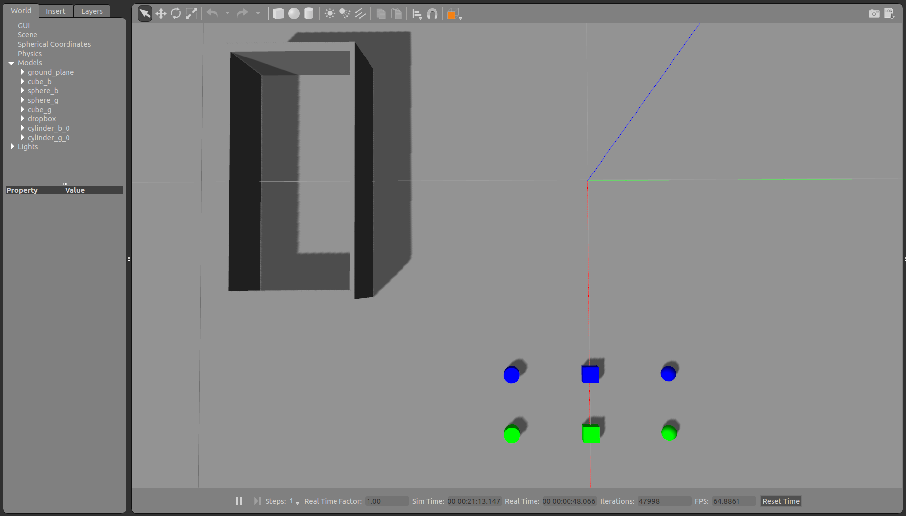
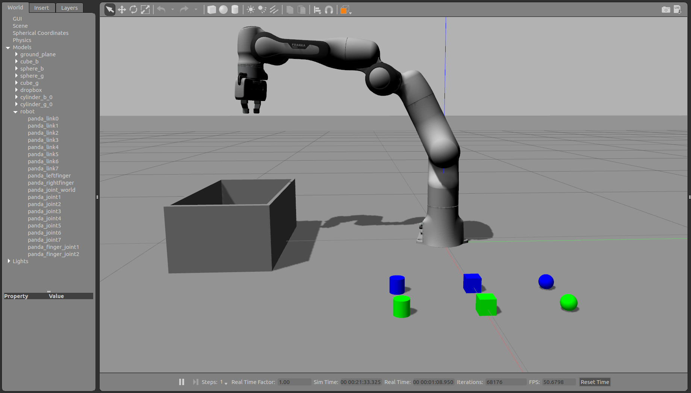
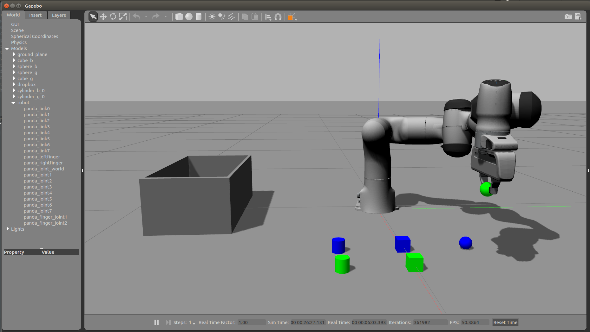
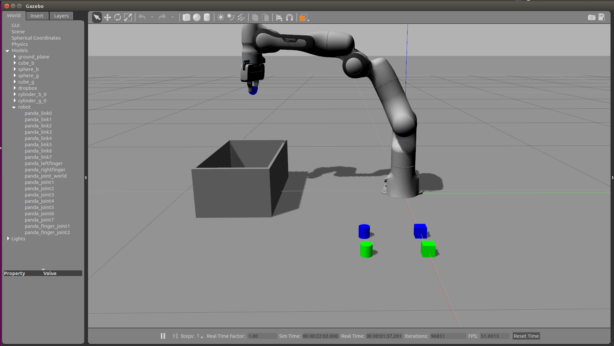
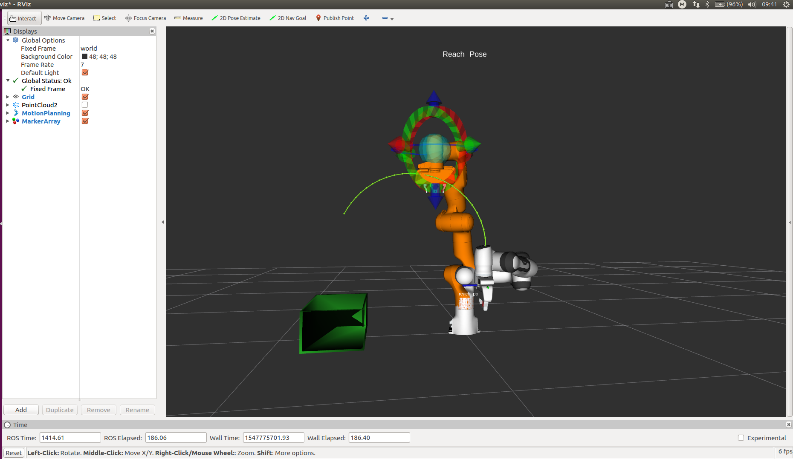

# BionicDL-CobotLearning-Project1
In this project, you must assimilate your work from previous exercises to successfully complete a tabletop pick and place operation using Franka in Gazebo.

The system is without perception and the pick list is given.

# Project Setup
Before running the project, make sure you've installed ROS kinetic (http://wiki.ros.org/kinetic/Installation/Ubuntu) and catkin_tools (https://catkin-tools.readthedocs.io/en/latest/installing.html).

For this setup, catkin_ws is the name of active ROS Workspace, if your workspace name is different, change the commands accordingly
If you do not have an active ROS workspace, you can create one by:
```sh
$ mkdir -p ~/catkin_ws/src
$ cd ~/catkin_ws/
$ catkin build
```

Now that you have a workspace, clone or download this repo into the src directory of your workspace:
```sh
$ cd ~/catkin_ws/src
$ git clone https://github.com/ancorasir/BionicDL-CobotLearning-Project1.git
```

Now install missing dependencies (ros-kinetic-libfranka) using rosdep install:
```sh
$ cd ~/catkin_ws
$ rosdep install --from-paths src --ignore-src --rosdistro=kinetic -y
$ sudo apt-get install ros-kinetic-moveit-visual-tools
$ sudo apt-get install ros-kinetic-trac-ik-kinematics-plugin
$ sudo pip install rospy_message_converter
```

Build the project:
```sh
$ cd ~/catkin_ws
$ catkin build
```

Add following to your .bashrc file
```sh
export GAZEBO_MODEL_PATH=~/catkin_ws/src/BionicDL-CobotLearning-Project1/franka_description/models:$GAZEBO_MODEL_PATH
source ~/catkin_ws/devel/setup.bash
```

Source .bashrc
```sh
source ~/.bashrc
```

# Run the demo:
0. Before running the demo, you might want to launch gazebo to see the grasping scene and check if you have the path set correctly for gazebo models. If everything is fine, press ctrl+c to exit.
```sh
roslaunch franka_gazebo test_world.launch
```


1. Launch the grasping scene with franka. You will see the following in Gazebo.
```sh
roslaunch franka_gazebo franka.launch
```


2. Run the grasping script.
```sh
rosrun franka_description project_grasp.py
```

You should see the franka starts to picking items and place them in the bin as shown below in gazebo.


You can also see the planning path of the arm in Rviz.

You can exit the ros grogram by ctrl+c at anytime.
